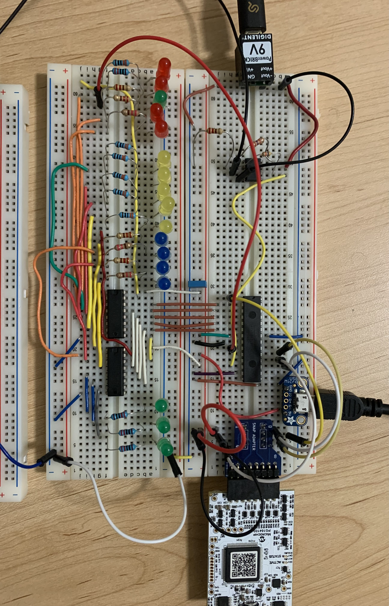

# Guitar-Tuner

Plug your guitar into the 1/4" mono audio jack and pluck the string you'd like to tune. The first 12 LEDs on the left indicate which note on the chromatic scale was plucked, and the five leds on the right indicate if you are above, below, or precisely on the desired note. If the target note LED lights up along with the green LED on the right, the string is in tune.
